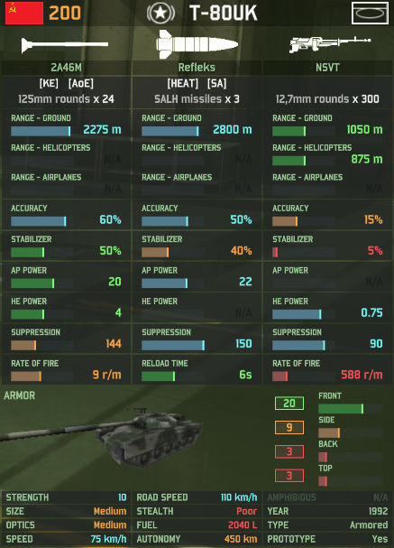

## Introduction

[Wargame: Red Dragon](https://en.wikipedia.org/wiki/Wargame:_Red_Dragon) is a real-time strategy video game which
simulates military encounters between democratic NATO (BLUFOR) and communist PACT (REDFOR) forces during the Cold War
. It is the third game in the series, published by the French company Eugen Entertainment; this particular iteration
is set in Asia, and introduced an Asian setting, Asian coalition members, and naval warfare to the game.

One of the game's draws is its fine-grained level of combat simulation. Players build "decks" composed of unit
"cards" to compete against one another with, and these cards provide a good at-a-glance overview of the complex and
combat simulation level the game's assets operate at:

Although the statistics on these cards are a good first-order approximation, there is a whole second cadre of
gameplay mechanics and characteristics that these cards don't provide information on, as well as a number of
inaccuracies in presentation.

There are hundreds of units like this one, and balancing real time strategy games is hard. I (and others) are interested
in examining interactions between different units in the game. To that effect, this project aims to provide a
reproducible export of the "true" Wargame: Red Dragon (henceforth RD) unit values for the purposes of examination.

## Process
### Overview

RD has an [active modding community](http://forums.eugensystems.com/viewforum.php?f=187) (as did its predecessor in
the series, AirLand Battle). This community has produced a number of tools to aid them in their work.

The most important of these is the [Wargame Modding Suite](http://forums.eugensystems.com/viewtopic.php?t=45922), which
provides a centralized way of accessing, decompiling, and making changes to the game's binary files. This tool has
its own [GitHub repository](https://github.com/enohka/moddingSuite); a (potentially outdated) copy of its
documentation is saved [here](figures\wargame-modding-suite.pdf), for the purposes of posterity.

A second-order tool, built on top of this bedrock one, is the [Data Exporter](http://forums.eugensystems.com/viewtopic.php?f=187&t=57927&sid=3be76da66f1adb0d5a78b97d9f2f0d94).
This tool packages the Modding Suite into a command line tool for extracting specific tables from the game files.

This would be enough in and of itself, but the information we're interested in isn't exposed in top-level tables;
it's instead packed into a descending chain of containers, called "modules". Every unit is a
`TUniteAuSolDescription` instance containing, amongst other things, a `TWeaponManagerModuleDescriptor`. Weapons in
Wargame are organized in terms of "turrets", which controls a weapon's spatial variables. This the weapons manager
module contains a list of `TTurrretUnitDescriptor`, a list of turrets, each of which itself
contains `TMoundedWeaponDescriptor` objects, each of which references a `TAmmunition` instance.

So to get a good, clean, well-formatted dataset, we need to export all of these tables, remap them to one another
out-of-binary, and then stitch their variables together.

### Getting the Raws

#### Manual Process

1. Download the [Data Exporter](http://forums.eugensystems.com/viewtopic.php?f=187&t=57927&sid=3be76da66f1adb0d5a78b97d9f2f0d94).
2. Navigate to the Wargame version files folder (usually e.g. `C:\Steam\steamapps\common\Wargame Red
Dragon\Data\WARGAME\PC`). Each of the subfolders of this directory is the files for a version of the game since
release; pick one and click through to it.
3. Unzip Data Exporter into the folder.
4. Open `Command Prompt`, navigate to the directory containing the files in question (e.g. `cd
C:\Steam\steamapps\common\Wargame Red Dragon\Data\WARGAME\PC\510049986`).
5. Run the following commands:

    WGTableExporter.exe NDF_Win.dat pc\ndf\patchable\gfx\everything.ndfbin TAmmunition
    WGTableExporter.exe NDF_Win.dat pc\ndf\patchable\gfx\everything.ndfbin TMountedWeaponDescriptor
    WGTableExporter.exe NDF_Win.dat pc\ndf\patchable\gfx\everything.ndfbin TTurretUnitDescriptor
    WGTableExporter.exe NDF_Win.dat pc\ndf\patchable\gfx\everything.ndfbin TTurretTwoAxisDescriptor
    WGTableExporter.exe NDF_Win.dat pc\ndf\patchable\gfx\everything.ndfbin TTurretInfanterieDescriptor
    WGTableExporter.exe NDF_Win.dat pc\ndf\patchable\gfx\everything.ndfbin TTurretBombardierDescriptor
    WGTableExporter.exe NDF_Win.dat pc\ndf\patchable\gfx\everything.ndfbin TWeaponManagerModuleDescriptor
    WGTableExporter.exe NDF_Win.dat pc\ndf\patchable\gfx\everything.ndfbin TModuleSelector
    WGTableExporter.exe NDF_Win.dat pc\ndf\patchable\gfx\everything.ndfbin TFuelModuleDescriptor
    WGTableExporter.exe NDF_Win.dat pc\ndf\patchable\gfx\everything.ndfbin TMouvementHandlerLandVehicleDescriptor
    WGTableExporter.exe NDF_Win.dat pc\ndf\patchable\gfx\everything.ndfbin TMouvementHandlerHelicopterDescriptor
    WGTableExporter.exe NDF_Win.dat pc\ndf\patchable\gfx\everything.ndfbin TMouvementHandlerAirplaneDescriptor
    WGTableExporter.exe NDF_Win.dat pc\ndf\patchable\gfx\everything.ndfbin TModernWarfareDamageModuleDescriptor
    WGTableExporter.exe NDF_Win.dat pc\ndf\patchable\gfx\everything.ndfbin VisibilityModuleDescriptor
    WGTableExporter.exe NDF_Win.dat pc\ndf\patchable\gfx\everything.ndfbin TModernWarfareExperienceModuleDescriptor

6. You will now have a subdirectory called `NDF_Win` in your folder, containing all of the raws. Cut-paste that to
wherever appropriate&mdash;in our case, as a subfolder of the version number under `raws` in this repository.

Currently only the most recent raw is available under `raws`. More forthcoming after I get merge
working.